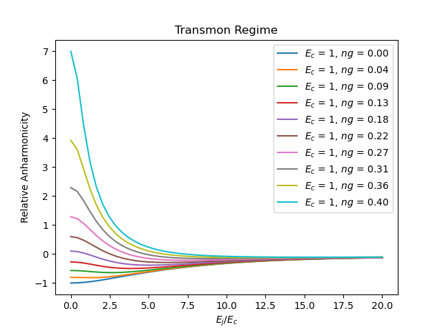
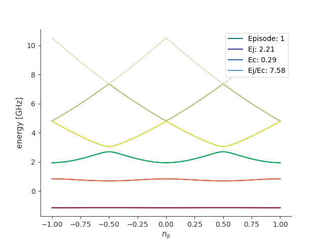
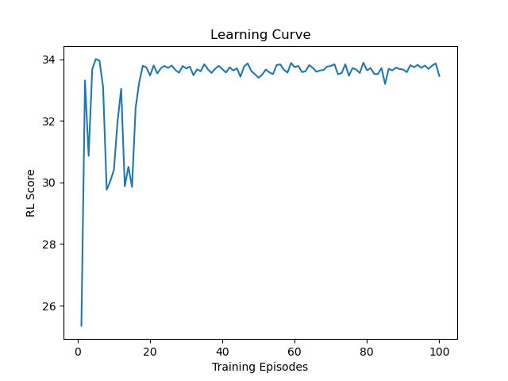

<!-- Logos -->

[](https://sonarcloud.io/summary/new_code?id=camponogaraviera_reinforce-transmon)

<a target="_blank" href="https://www.tensorflow.org/"></a>
&nbsp;
<a href="https://github.com/scqubits"></a>

<!-- Badges -->

[](https://www.python.org/downloads/)
[](https://numpy.org)
[](https://www.tensorflow.org/install/source#gpu)

<!-- Sonar Badges -->

[](https://sonarcloud.io/summary/new_code?id=camponogaraviera_reinforce-transmon)

[](https://sonarcloud.io/summary/new_code?id=camponogaraviera_reinforce-transmon)
[](https://sonarcloud.io/summary/new_code?id=camponogaraviera_reinforce-transmon)
[](https://sonarcloud.io/summary/new_code?id=camponogaraviera_reinforce-transmon)

[](https://sonarcloud.io/summary/new_code?id=camponogaraviera_reinforce-transmon)
[](https://sonarcloud.io/summary/new_code?id=camponogaraviera_reinforce-transmon)
[](https://sonarcloud.io/summary/new_code?id=camponogaraviera_reinforce-transmon)
[](https://sonarcloud.io/summary/new_code?id=camponogaraviera_reinforce-transmon)
[](https://sonarcloud.io/summary/new_code?id=camponogaraviera_reinforce-transmon)

> Originally implemented in 2023. Codebase refactoring and package updates in 2026.

<!-- Title -->
<div align="center">
  <h1> RL DDPG System </h1>
  <h2> Finding Transmon Qubit Sweet Spots with RL DDPG <h2>
</div>

# About

A DDPG-based reinforcement learning system for finding optimal operating regimes (sweet spots) in [transmon qubits](https://journals.aps.org/pra/abstract/10.1103/PhysRevA.76.042319), maximizing anharmonicity and T2 coherence time.

- Provides a custom `Gym-compliant` environment built from scratch with `NumPy` and `scQubits` to simulate superconducting qubits, featuring continuous observation and action spaces.
- Implements a [DDPG](https://arxiv.org/abs/1509.02971)-based continuous control agent from scratch in TensorFlow 2 (Actor, Critic, target networks, learning method) without relying on high-level RL libraries.
- Packaged as a modular, production-grade Python library following industry best practices.

---

<!-- #region Motivation -->
<details>
  <summary><h1 id="mot"> Motivation </h1></summary>

Is reinforcement learning necessary for this problem? 

In the current scope, in the absence of environment-driven temporal dynamics, no. Even under noise channels, the task reduces to a stochastic black-box parameter optimization problem rather than a sequential decision-making (control) problem. It can be addressed using standard stochastic optimization methods such as Bayesian optimization.

When is RL useful?

RL becomes suitable for problems with temporal dynamics and partial observability, where future decisions indirectly depend on past actions via state evolution. Certain problems, such as virtual quantum circuit optimization and qubit routing, can be formulated as sequential decision-making tasks and therefore as reinforcement learning (RL) problems. In practice, however, they are commonly addressed using classical optimization techniques (e.g., peephole), search algorithms (e.g., BFS, beam search), and heuristics rather than RL. 

For example, small-scale circuit synthesis can be performed using SAT/SMT solvers, while Qiskit's current layout selection and qubit routing are based on [LightSABRE](https://arxiv.org/abs/2409.08368), with implementations such as [Sabre Layout](https://quantum.cloud.ibm.com/docs/en/api/qiskit/qiskit.transpiler.passes.SabreLayout) and [Sabre Swap](https://quantum.cloud.ibm.com/docs/en/api/qiskit/qiskit.transpiler.passes.SabreSwap).

Why is RL used here?

The primary goal of this project is educational: to help students understand how reinforcement learning systems are implemented from first principles, rather than relying on pre-built implementations where solutions can be replicated without deep understanding.

## RL Intro 

Reinforcement learning (RL) is a framework for sequential decision-making, often formalized as a Markov Decision Process (MDP). In practice, some settings involve partial observability, for example, a Partially Observed Markov Decision Process (POMDP), where the agent does not have access to the full state of the environment.

A **Markov Decision Process (MDP)** is a `discrete-time stochastic control process` that models the interaction between an agent and an environment with transitions satisfying the `Markov property`, and is defined as a 5-tuple:

$$(S, A, \mathcal{P}, R, \rho_0).$$

Legend:

- $S$ is the state space.

- $A$ is the action space.

- $\mathcal{P}: S \times A \rightarrow  \Delta(S)$ is the transition probability distribution.

- $R(s, a, s') or R: S \times A \times S \rightarrow {\rm I\!R}$ is the reward function.

- $\rho_0 \in \Delta(S)$ is the initial (starting) state distribution.

- $\Delta(S)$ is the set of probability distributions over $S$.

The `Markov property` states that the probability of the next state depends only on the current state and action, not the full history. In other words: the future is independent of the past given the present. 

This can be mathematically formalized as:

$$\mathcal{P}(s_{t+1} | s_t, a_t) = \mathbb{P}(s_{t+1} | s_0, a_0, \cdots, s_t, a_t).$$

Equivalently:

$$\mathcal{P}(s_{t+1}, r_{t+1} | s_t, a_t) = \mathcal{P}(s_{t+1}, r_{t+1} | s_0, a_0, \cdots, s_t, a_t).$$

An MDP is a stochastic control process because its dynamics (transitions) are modeled using conditional probability distributions, even though the underlying system (environment) may be deterministic.

The goal of RL is to learn a policy that maximizes the expected cumulative (often discounted) reward over a trajectory.

## Transmon Regime

The transmon regime is an operating condition where the ratio between $E_j$ (Josephson energy) and $E_c$ (charging energy) is increased ($E_j/E_c >>1$) to make the solid-state qubit insensitive to charge fluctuations. One way of achieving this regime is by increasing the overall capacitance value $C_{\Sigma}$, therefore decreasing $E_c$. In this regime, the anharmonicity is approximately $\alpha = \omega_{12} - \omega_{01} \approx -E_c$.

However, there is a tradeoff. For very large $E_j/E_c$ (small $|\alpha|$), the system becomes nearly harmonic, and leakage to higher energy levels during fast gates increases. For smaller $E_j/E_c$ (larger $|\alpha|$), charge dispersion increases and the qubit moves toward the charge-sensitive (Cooper-pair box) regime.

</details>
<!-- #endregion -->

---

<!-- #region Results -->
<details open>
  <summary><h1 id="res"> Results </h1></summary>

<!-- Transmon Regime -->
<br>
<div align="center">
  <a href="#"></a>
</div>

<!-- Anharmonicity GIF -->
<br>
<div align="center">
  <a href="#"></a>
</div>

<!-- RL Score -->
<br>
<div align="center">
  <a href="#"></a>
</div>

</details>
<!-- #endregion -->

---

<!-- #region Project Architecture & Technology Stack -->
<details>
  <summary><h1 id="tech">Project Architecture & Technology Stack</h1></summary>

See [README-TEC.md](developers_guide/README-TEC.md).

</details>
<!-- #endregion -->

---

<!-- #region Implementation Details -->
<details>
  <summary><h1 id="details">Implementation Details</h1></summary>

  <!-- #region Environment Class -->
  <details>
    <summary><h3 id="environment">$\sf\color{#77bdfb}Environment \space Class$</h3></summary>
    
The [TransmonQubitEnv](reinforce_transmon/src/envs/transmon.py) **Environment Class** is designed to be Gym-compliant, and it depends on [scQubits](https://github.com/scqubits). It models a transmon qubit with three tunable parameters:

- **Ej**: Josephson energy.
- **Ec**: Charging (capacitive) energy.
- **Ng**: Offset charge.

  <!-- #region Environment Class -->
  </details>

  <!-- #region Agent Class -->
  <details>
    <summary><h3 id="agent">$\sf\color{#77bdfb}Agent \space Class$</h3></summary>

- [DDPGAgent](reinforce_transmon/src/rl/agent.py) **Class**: Includes methods to select actions, store transitions in a replay buffer, train actor and critic networks, update soft target networks, and save/load model weights.
  - [\_build_networks()](reinforce_transmon/src/rl/agent.py#L146) **Method**: Build networks with placeholders to load model weights.
  - [\_scale_action()](reinforce_transmon/src/rl/agent.py#L162) **Method**: Linearly scale actions from [-1, 1] to the environment's action space.
  - [\_update_target_networks()](reinforce_transmon/src/rl/agent.py#L176) **Method**: Updates Target Actor and Target Critic networks using the `polyak averaging update rule`.
  - [get_action()](reinforce_transmon/src/rl/agent.py#L198) **Method**: Get an action from the Policy network and adds Gaussian noise for exploration.
  - [store_transition()](reinforce_transmon/src/rl/agent.py#L241) **Method**: Uses the [ReplayBuffer](reinforce_transmon/src/rl/replay_buffer.py) class to store episode transitions in pre-allocated NumPy arrays within a Python dictionary.
  - [learn()](reinforce_transmon/src/rl/agent.py#L265) **Method**: Implemented using `TensorFlow 2 GradientTape API`.
    - Trains Critic network by minimizing the `Mean-squared Bellman Error (MSBE) loss` with `gradient descent` via Adam optimizer.
    - Trains Actor network by maximizing the `Deterministic Policy Gradient (DPG) loss` with `gradient ascent` via Adam optimizer.
  - [save_model()](reinforce_transmon/src/rl/agent.py#L330) **Method**: Save the full model, including architecture and weights.
  - [load_model_weights()](reinforce_transmon/src/rl/agent.py#L372) **Method**: Load model weights only (no optimizer state).
  - [load_full_models()](reinforce_transmon/src/rl/agent.py#L404) **Method**: Load full models (architecture + weights + optimizer state).

  <!-- #region Agent Class -->
  </details>
    
  <!-- #region Observation Space Representation -->
  <details>
    <summary><h3 id="observation-space-representation">$\sf\color{#77bdfb}Observation \space Representation$</h3></summary>

The **Observation Space** is a continuous `3-dimensional vector` representing the current physical parameters of the Transmon qubit (Ej, Ec, Ng). Each dimension is bounded by predefined minimum and maximum values. It is implemented using `gym.spaces.Box`.

  </details>
  <!-- #endregion Observation Space Representation -->

  <!-- #region Action Space Representation -->
  <details>
  <summary><h3 id="action-space-representation">$\sf\color{#77bdfb}Action \space Representation$</h3></summary>
  
The **Action Space** is a continuous `3-dimensional vector` representing incremental adjustments to the qubit parameters. Each dimension is bounded in the range [-1, 1]. It is implemented using `gym.spaces.Box`.

The **Action Update Rule** inside the `step()` method of the environment class updates the state using element-wise addition (`state_{t+1} = clip(state_t + action)`.

  </details>
  <!-- #endregion Action Space Representation -->

  <!-- #region Actor Network -->
  <details>
  <summary><h3 id="actor-network">$\sf\color{#77bdfb}Actor \space Network$</h3></summary>

The [ActorNetwork](reinforce_transmon/src/rl/networks.py) is a multilayer perceptron (MLP) with two hidden layers implemented using `TensorFlow 2 Model Subclassing API`.

- The actor network outputs deterministic continuous actions using a `tanh activation` function, with dimensionality equal to the number of action dimensions.
- The target actor network is an instance of the actor network.
- For exploration during training, Gaussian noise is added to the policy output before applying it to the environment.

  </details>
  <!-- #endregion Actor Network -->

  <!-- #region Critic Network -->
  <details>
  <summary><h3 id="critic-network">$\sf\color{#77bdfb}Critic \space Network$</h3></summary>

The [CriticNetwork](reinforce_transmon/src/rl/networks.py) is a multilayer perceptron (MLP) with two hidden layers implemented using `TensorFlow 2 Model Subclassing API`.

- The critic network takes both state and action as input (concatenated) and outputs a scalar Q-value.
- The target critic network is an instance of the critic network.

  </details>
  <!-- #endregion Critic Network -->

  <!-- #region Reward Function -->
  <details>
  <summary><h3 id="reward-function">$\sf\color{#77bdfb}Reward \space Function$</h3></summary>

The **Reward Function** minimizes charge dispersion (ng sensitivity), maximizes anharmonicity, and maximizes $T_2$ coherence time.

  </details>
  <!-- #endregion Reward Function -->
  
</details>
<!-- #endregion Implementation Details -->

---

<!-- #region Conda Environment -->
<details>
  <summary><h1 id="conda">Conda Environment</h1></summary>

## CPU

```bash
conda env create -f cpu_environment.yml && conda activate rl-transmon-cpu
```

## GPU

```bash
conda env create -f gpu_environment.yml && conda activate rl-transmon-gpu
```

Check GPU:

```bash
python -c "import tensorflow as tf; print(tf.config.list_physical_devices('GPU'))"
```

`>>> [PhysicalDevice(name='/physical_device:GPU:0', device_type='GPU')]`

Note: Keras is shipped standard with TensorFlow.

</details>
<!-- #endregion Conda Environment -->

---

<!-- #region Install Package -->
<details>
  <summary><h1 id="install-package">Install Package</h1></summary>

- Install the package in editable mode:

```bash
python -m pip install --no-deps -v -e .
```

- Show help:

```bash
reinforce_transmon -h
```

</details>
<!-- #endregion Install Package -->

---

<!-- #region Package Usage -->
<details>
  <summary><h1 id="run-as-a-package">Package Usage</h1></summary>

```python
import reinforce_transmon as rt
rt.about()

# Instantiate environment and agent with default params:
env = rt.TransmonQubitEnv()
agent = rt.DDPGAgent()

# Train:
score_history = rt.train(env=env, agent=agent, num_episodes=100, max_steps=100, render=True)
```

</details>
<!-- #endregion  Package Usage -->

---

<!-- #region Demo -->
<details>
  <summary><h1 id="">Demo</h1></summary>

- Check whether the environment is Gym-compliant.

```bash
python -m reinforce_transmon.src.utils.check_env
```

- Plot the transmon regime curve for different ng values:

```bash
python reinforce_transmon/scripts/transmon_regime.py
```

```ShellSession
usage: reinforce_transmon [-h] [--render-state] [--inference]

options:
  -h, --help      Show help message and exit.
  --render        Save plot of energy levels during training.
  --inference     Run inference (no training).
```

- Train with hyperparameters defined in `configs/config.cfg` (uses a global seed for reproducibility):

```bash
reinforce_transmon
```

</details>
<!-- #endregion Demo -->
